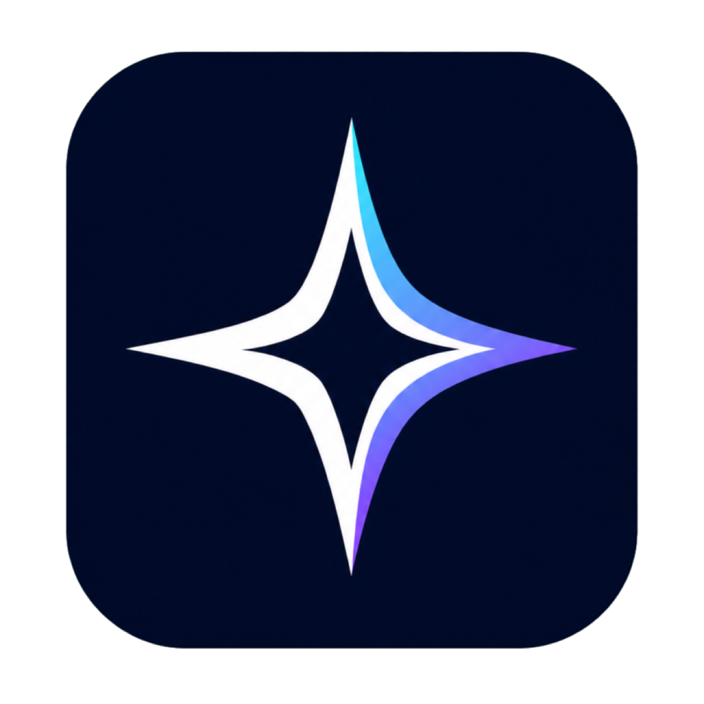

# RealityLink

<p align="center">
  
</p>

**语言: [English](README.md) · [中文](README.zh.md)**

RealityLink 是一款面向 macOS、Windows 和 Linux 的开源桌面客户端。可以管理节点和订阅、一键切换连接模式,流量可通过系统代理或全局 TUN 接管。数据面使用经过广泛验证的 `sing-box` 内核。

## 1. 下载

| 系统 | 设备 | 下载 0.2.0 |
| --- | --- | --- |
| macOS | Apple Silicon(M1–M4) | [ARM64 ZIP](https://github.com/Develop-StarDustZ/RealityLink/releases/download/v0.2.0/RealityLink-0.2.0-macOS-arm64.zip) |
| macOS | Intel Mac | [Intel ZIP](https://github.com/Develop-StarDustZ/RealityLink/releases/download/v0.2.0/RealityLink-0.2.0-macOS-x64.zip) |
| macOS | 不确定 | [Universal ZIP](https://github.com/Develop-StarDustZ/RealityLink/releases/download/v0.2.0/RealityLink-0.2.0-macOS-universal.zip) |
| Windows | 大多数电脑 | [安装版](https://github.com/Develop-StarDustZ/RealityLink/releases/download/v0.2.0/RealityLink-0.2.0-windows-x64-setup.exe) · [便携版](https://github.com/Develop-StarDustZ/RealityLink/releases/download/v0.2.0/RealityLink-0.2.0-windows-x64-portable.exe) |
| Windows | ARM 设备 | [安装版](https://github.com/Develop-StarDustZ/RealityLink/releases/download/v0.2.0/RealityLink-0.2.0-windows-arm64-setup.exe) · [便携版](https://github.com/Develop-StarDustZ/RealityLink/releases/download/v0.2.0/RealityLink-0.2.0-windows-arm64-portable.exe) |
| Linux | Intel/AMD | [AppImage](https://github.com/Develop-StarDustZ/RealityLink/releases/download/v0.2.0/RealityLink-0.2.0-linux-x86_64.AppImage) · [DEB](https://github.com/Develop-StarDustZ/RealityLink/releases/download/v0.2.0/RealityLink-0.2.0-linux-amd64.deb) |
| Linux | ARM64 | [AppImage](https://github.com/Develop-StarDustZ/RealityLink/releases/download/v0.2.0/RealityLink-0.2.0-linux-arm64.AppImage) · [DEB](https://github.com/Develop-StarDustZ/RealityLink/releases/download/v0.2.0/RealityLink-0.2.0-linux-arm64.deb) |

## 2. 安装

- **macOS**:解压 ZIP,把 `RealityLink.app` 拖入"应用程序"。首次打开按住 Control 点击 → 打开 → 再次确认。如果系统阻止,打开"系统设置 → 隐私与安全性"点"仍要打开"。
- **Windows**:双击安装版,按提示完成;或双击便携版直接运行(不要在连接时移动文件)。如果 SmartScreen 提示,选"更多信息 → 仍要运行"。
- **Linux**:AppImage 双击即可(系统询问时选"运行");DEB 双击用软件中心安装,按提示输入密码。

## 3. 第一次使用

1. 点击"导入链接",粘贴节点、`sub://` 或 HTTP(S) 订阅。
2. 选择模式:系统代理 或 全局 TUN。
3. 选择节点,点击"连接"。需要时输入管理员密码。
4. 复制日志前请删除服务器地址、UUID、密码等凭据。

## 4. 功能

- 支持 VLESS、VMess、Trojan、Shadowsocks、Hysteria2、TUIC,以及订阅链接
- 菜单栏快速连接/断开、实时日志、配置持久化
- macOS 原生 SwiftUI;Linux/Windows 基于 Electron
- 启动前调用 `sing-box check`,避免无效配置影响网络

## 5. 平台说明

- **macOS 13+**,使用 SwiftUI(`[macOS/](macOS/)`)
- **Linux** Ubuntu/Debian 桌面(`[Linux/](Linux/)`)
- **Windows 10/11**(`[Windows/](Windows/)`)

## 6. 帮助

- Bug 与功能请求:[Issues](https://github.com/Develop-StarDustZ/RealityLink/issues)
- 安全漏洞:仓库 **Security → Report a vulnerability**(不要公开)
- 邮箱:[develop@stardustz.com](mailto:develop@stardustz.com)
- 报告问题请注明版本、操作系统、芯片类型,以及怎么操作、出现什么。**不要提交真实节点链接或凭据。**

## 开发

### 从源码构建

```bash
git clone https://github.com/Develop-StarDustZ/RealityLink.git
cd RealityLink

# macOS — SwiftUI,需要 macOS 13 + Xcode 15 / Swift 5.10
swift run --package-path macOS          # 直接运行
./Scripts/build-app.sh                  # 生成可打开的 .app

# Linux / Windows — Electron,需要 Node 22
cd Linux && npm ci && npm test
cd Windows && npm ci && npm test
```

### 发布构建

`Scripts/release.sh` 固定使用 sing-box 1.13.14,下载上游归档、校验 SHA-256,
并生成签名 ZIP 与校验文件到 `dist/`。

```bash
./Scripts/release.sh
(cd dist/macos/arm64 && shasum -a 256 -c RealityLink-0.2.0-macOS-arm64.zip.sha256)
```

推送形如 `v0.2.0` 的标签会触发 `.github/workflows/release.yml`,在 CI 上重新
构建三个平台并发布 GitHub Release。

```bash
git tag -a v0.2.0 -m "RealityLink 0.2.0"
git push origin v0.2.0
```

### 在空仓库上首次发布

```bash
git init -b main
git add .
git commit -m "Release RealityLink 0.2.0"
git remote add origin git@github.com:Develop-StarDustZ/RealityLink.git
git push -u origin main
```

GitHub 仓库**先建空**——不要在网页端预先生成 README / LICENSE / .gitignore,
否则首次推送会冲突。

## 说明

- 请只连接自己拥有或获准使用的服务器,并遵守所在地法律和网络服务条款。
- macOS 未签名构建首次打开会被 Gatekeeper 拦截,本 README 的安装步骤已说明如何打开。
- Windows 未使用商业 Authenticode 证书的构建会触发 SmartScreen。
- 各平台首次建立 TUN 连接时都会要求管理员授权:macOS 系统授权、Linux `pkexec`、Windows UAC。发布前应在真实硬件上完成一次冒烟测试。

## 仓库结构

```text
RealityLink/
├── macOS/      SwiftUI 源码、资源、测试
├── Linux/      Electron 客户端
├── Windows/    Electron 客户端
├── Assets/     品牌源素材
├── Scripts/    跨平台构建与发布脚本
├── README.md   英文版(默认)
├── README.zh.md  中文版
└── dist/       本地发布成品(已 gitignore)
```

## 许可证

GPL-3.0-or-later,完整条款见 [LICENSE](LICENSE)。内置的 `sing-box` 同样使用
GPL-3.0-or-later,其版权和固定版本列在第三方声明中。
